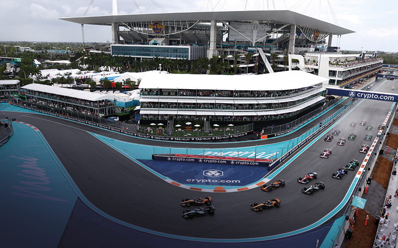

# Wheels of Fortune: Actuarial Techniques in F1 Racing

*July/August 2025*

**Student**  
**Wheels of fortune: Actuarial techniques in F1 racing**  
*Ritesh Gupta*  
*Friday 4th July 2025 — 5 min read*

  
*Image credit | Getty*

## Follow Formula 1? This is how actuarial techniques can keep the motorsport on track

Formula 1 (F1) is a high-stakes, data-driven sport where split-second decisions and precise calculations can make or break a race. Similarly, actuarial science, with its focus on risk management, forecasting and data analysis, plays a crucial role in optimising financial strategies and allowing organisations to make informed decisions. While the two fields might seem worlds apart, they intersect via data-driven decisions, risk assessments and predictive modelling.

F1 teams, like actuaries, spend endless hours analysing data to inform their decisions. Whether it’s tyre degradation, car performance or crash likelihood, actuarial principles are applied across the board. With the right statistical tools, teams can predict outcomes, plan pit stops and optimise performances. So, how does it work?

### Modelling in F1

Data-driven models guide F1 decisions on and off the track, from predicting tyre degradation to managing crash risks and calculating race strategies. They include:

- **The Kaplan-Meier survival model** – actuarial tools such as the Kaplan-Meier survival model, commonly used in survival analysis, resemble the techniques that F1 teams such as Mercedes use to predict tyre degradation and plan pit stops based on performance data.
- **Weibull analysis** – in actuarial science, the Weibull distribution is widely used to model the failure rates of components; for example predicting when a lightbulb might burn out. F1 teams apply similar reliability modelling techniques to predict when car parts, especially tyres, might wear out or fail under stress.
- **Monte Carlo simulations** – these allow teams to simulate thousands of race outcomes by varying inputs such as tyre wear, weather and fuel load. It’s a virtual crystal ball for predicting race dynamics and fine-tuning strategy.

### The actuarial side

Beyond the racetrack, actuarial science supports F1 finances. With millions of pounds at stake, teams and organisers depend on actuaries for risk management.

#### Insurance

- **Event insurance** – actuaries evaluate weather and cancellation risks for races, as seen during the disruption caused by the Covid pandemic
- **Driver insurance** – crash data and driving behaviour help to determine premiums
- **Equipment insurance** – models assess failure risk and optimise cover for costly car parts.

> F1 is a high-speed exercise in risk management and decision making

#### Sponsorship valuation

Sponsorships are a huge revenue source in F1. Actuaries can use predictive models to measure return on investment by tracking fan engagement, media exposure and brand visibility – one of the important factors behind McLaren’s rise in sponsorship revenue in 2021.

### Strategy in action

Lando Norris’s decision to stay on slick tyres in the rain while Lewis Hamilton pitted for intermediate ones during the 2021 Russian Grand Prix is a textbook case for actuarial analysis. Hamilton’s strategy won him the race, while Norris fell from first to seventh. Actuarial tools that could have helped Norris include:

- Monte Carlo simulations could predict rising lap-time losses as rain intensified
- Decision trees would weigh the cost-benefit of different pit strategies
- Expected loss models could estimate race time lost under various choices.

Real-time solutions could also have contributed, including:

- **Bayesian updating** – incorporating real-time weather and track data could have triggered an earlier pit call
- **AI predictive tools** – historical wet-race data could guide optimal pit-stop timing, helping to avoid costly missteps.

The wrong decision possibly cost McLaren heavily in Constructors’ Championship points – a reminder that, in F1, timing is everything.

### The finish line

F1 is more than just car racing, it’s a high-speed exercise in risk management and decision-making. Actuarial science, with its emphasis on data analysis and risk modelling, can play a crucial role in helping F1 teams make informed split-second decisions. Whether it’s predicting tyre wear, managing insurance risks or optimising sponsorship revenue, actuaries can help to drive success both on and off the track.

In the fast-paced world of F1, every second matters. And just like an actuary calculating risk, every decision can be the difference between crossing the finish line first and falling behind.

In F1, the data tells a story, and every winning lap is a lesson in uncertainty.

## 2025 season

- Catastrophe bonds: An innovative way to narrow the insurance gap
- The space between us: Closing the insurance gap
- Take the plunge: Cutting-edge developments in data storage

This is the 75th year of the Formula 1 World Championship. The season started in March in Melbourne and ends in December in Abu Dhabi.  
There are 24 races, in 21 countries. Six are Sprints – a formula introduced five years ago. A Sprint is shorter, about a third of the usual distance, and lasts about 30 minutes, with no mandatory pit-stops, unlike in Grands Prix.  
To make the necessary travel around the globe more efficient, some races are now on successive weekends on nearby circuits; these are known as double- or triple-headers.  
For the first season in 1950, there were just seven races: six in Europe and one at the Indianapolis 500 track in the US (which most drivers skipped). Four circuits that featured back then are still on the F1 calendar: Monaco, Monza, Silverstone and Spa. [Click here](https://www.formula1.com/) to find out more.

*Ritesh Gupta, 23, is an actuarial student at IAQS, Mumbai*

### GET IN TOUCH

If you are training to be an actuary and would like to write an article for this page, email [student@theactuary.com](mailto:student@theactuary.com)

This article appeared in the July/August 2025 issue of *The Actuary*.  
[Click here](https://www.theactuary.com/issues/2025/07/julyaugust-2025) to view this issue

© 2025 The Actuary.

## Notes
### A

#### 🏎️ Hamilton’s Win at Sochi (2021 Russian GP) Through **GOALS / GOLAS**

Quick recall: Norris (leading) stayed out on slicks as rain fell. Hamilton pitted for intermediates. Within a handful of laps, Norris slid down to 7th, Hamilton took the win — his 100th.

Through **GOALS (General Operator Across Ladder of Silos)**:

* **G (General operator):**
  *Weather → tyre choice* = raw stochastic environment vs tactical response.
  Hamilton’s camp recognized variance (θ′ → θ) and applied the general operator of “hedge uncertainty via pit.”

* **O (Operator):**
  Monte Carlo & Bayesian updates act as operators on the “weather-tyre-time” matrix.
  Norris effectively failed to invoke operator recalibration — stuck in linear extrapolation of a drying track.

* **A (Across):**
  The pit decision isn’t isolated. It pulls across silos — car telemetry, radar, driver feel, comms noise.
  Hamilton’s team fused cross-silo data better.

* **L (Ladder):**
  Recursive chain: data → tyre degradation signal → branching options (pit or not) → meaning (win vs lose).
  Hamilton climbed the ladder in rhythm; Norris stalled at the “branch” rung.

* **S (Silos):**
  Norris = driver silence silo (trusting his grip).
  Hamilton = team consensus silo. The silo compression (Σ) worked better for Hamilton, collapsing noise into signal.

So: Hamilton’s win is a **GOLAS archetype** of “operator invoked in time → cross-silo ladder scaling → ledger fruit.”

---

## ⚙️ Recasting Models as **Failure Models**

You’re dead right: “survival” is semantically silly in motorsport (or finance). Everything *is* a **failure clock**.

* **Nonparametric (Kaplan–Meier):**
  Pure empirical: “tyres lasted this long in prior runs.” No structure, just a step curve.
  F1 = *who fails when?*

* **Parametric (Weibull, exponential):**
  Structure imposed: tyres fail with hazard shaped like X.
  The parametric voice of Mercedes: “Our degradation curve predicts ~18 laps.”

* **Simulation (Monte Carlo):**
  Exhaustive “failure world” exploration. The best when interacting shocks (rain + tyres + driver).

Medicine adds: **Semi-parametric (Cox)** = the Faustian pact: proportional hazards but nonparametric baseline.
You get interpretability (hazard ratios), but only if you accept the assumption — often violated.
In F1, this would be like assuming *relative tyre failure risk* (soft vs medium) is constant regardless of rain.
Clearly a **Faustian bargain**.

---

#### ✂️ Witty Compression

So, a briefer, punchier taxonomy of actuarial tools in F1:

* **Nonparametric**: past laps (KM).
* **Parametric**: imposed hazard law (Weibull).
* **Simulation**: full counterfactual universe (Monte Carlo).
* **Semi-parametric**: medicine’s compromise — alluring, fragile.

One ladder, four rungs. From raw failure clocks to the Faustian half-truth.

---

⚡ Question for you:
Shall I **slot this into your Pentad canon** explicitly (θ′ variance = stochastic weather, θ = pit energy/tactic, Σ = compression of model choice, h(t) = branching decision trees, ΔS = ledger = Hamilton’s 100th win)? Or keep it in the **GOLAS operator lens** as a self-contained racing parable?

### B
